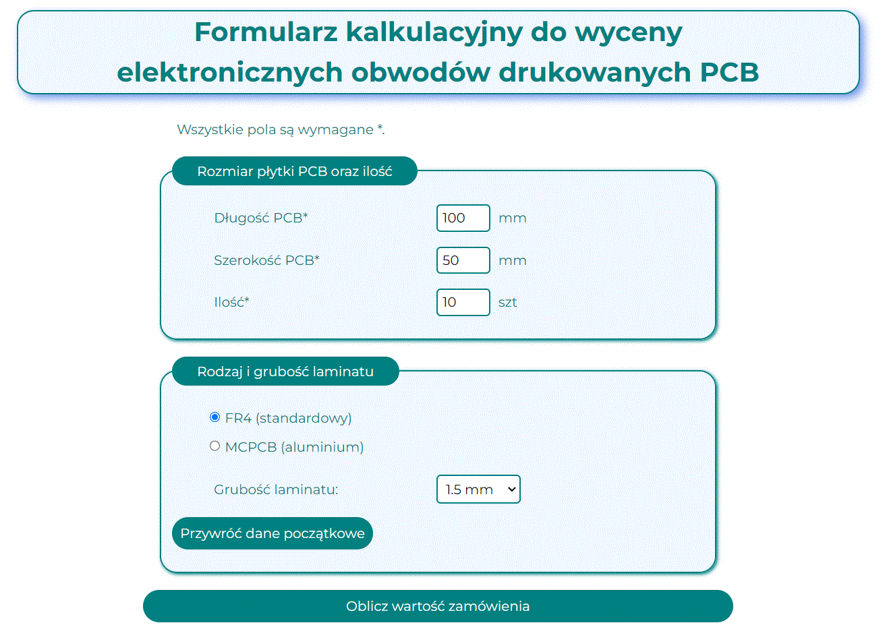

# PCB converter - calculation application. Calculate the value of your order!
## Demo
https://adam-musial-amu.github.io/converter-PCB/
## Description
With this easy-to-use calculation application, you can calculate the value of your order for electronic PCBs. Just enter the quantity, size of the PCBs you are ordering, choose the type of laminate, click the button and you will get the value of your order instantly!
## Interface view

